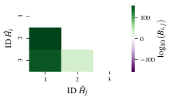
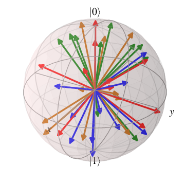
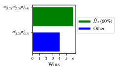
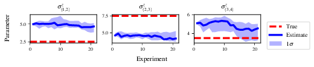
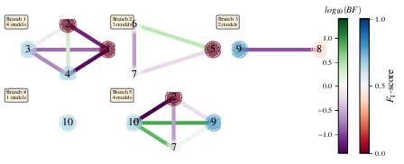
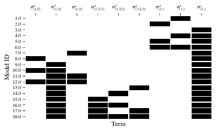

.. role:: raw-math(raw)
    :format: latex html

Tutorial
========

Here we provide a complete example of how to run the framework,
including how to implement a custom :term:`Exploration Strategy` (:term:`ES`), and generate/interpret analysis.

.. _section_installation:

Installation 
------------
First, *fork* the :term:`QMLA` codebase from
[QMLA]_ to a Github user account (referred to as :code:`username` in the following code snippet). 
Now, we must download the code base and
ensure it runs properly; these instructions are implemented via the
command line.
Note: these instructions are tested for Linux and presumed to work on Mac, but untested on Windows. 
It is likely some of the underlying software (redis servers) can not be installed on Windows,
so running on *Windows Subsystem for Linux* is advised. 

The steps of preparing the codebase are

#. install redis

#. create a virtual Python environment for installing :term:`QMLA` dependencies
   without damaging other parts of the user’s environment

#. download the [QMLA]_ codebase from the forked Github repository

#. install packages upon which :term:`QMLA` depends.

.. code-block:: 
    :name: qmla_setup

    # Install redis (database broker)
    sudo apt update
    sudo apt install redis-server
     
    # make directory for QMLA
    cd
    mkdir qmla_test
    cd qmla_test

    # make Python virtual environment for QMLA
    # note: change Python3.6 to desired version
    sudo apt-get install python3.6-venv 
    python3.6 -m venv qmla-env    
    source qmla-env/bin/activate

    # Download QMLA
    git clone --depth 1 https://github.com/username/QMLA.git # REPLACE username

    # Install dependencies
    cd QMLA 
    pip install -r requirements.txt 

Note there may be a problem with some packages in the arising from the
attempt to install them all through a single call to :code:`pip install`. 
Ensure these are all installed before proceeding.
When all of the requirements are installed, test that the framework
runs. :term:`QMLA` uses databases to store intermittent data: we must
manually initialise the database. Run the following 
(note: here we list :code:`redis-4.0.8`, but this must be corrected to reflect the version installed on the
user’s machine in the above setup section):

::

    ~/redis-4.0.8/src/redis-server

which should give something like :numref:`fig:terminal_redis`.

.. figure:: figures/terminal_redis.png
   :alt: Terminal running :code:`redis-server`.
   :width: 75.0%
   :name: fig:terminal_redis

   Terminal running :code:`redis-server`.

In a text editor, open ``QMLA/launch/local_launch.sh``, 
the script used to run the codebase;  
here we will ensure that we are running the
algorithm, with 5 experiments and 20 particles, on the
:term:`ES` named :code:`TestInstall`.
Ensure the first few lines of read:

::

    #!/bin/bash

    ##### -------------------------------------------------- #####
    # QMLA run configuration
    ##### -------------------------------------------------- #####
    num_instances=2 # number of instances in run
    run_qhl=0 # perform QHL on known (true) model
    run_qhl_multi_model=0 # perform QHL for defined list of models
    experiments=2 # number of experiments
    particles=10 # number of particles
    plot_level=5

    ##### -------------------------------------------------- #####
    # Choose an exploration strategy 
    # This will determine how QMLA proceeds. 
    ##### -------------------------------------------------- #####
    exploration_strategy="TestInstall"

Ensure the terminal running redis is kept active, and
open a separate terminal window. 
We must activate the Python virtual environment configured for :term:`QMLA`, 
which we set up above. 
Then, navigate to the :term:`QMLA` directory, and launch:

::

    # activate the QMLA Python virtual environment 
    source qmla_test/qmla-env/bin/activate

    # move to the QMLA directory 
    cd qmla_test/QMLA
    # Run QMLA
    cd launch   
    ./local_launch.sh

There may be numerous warnings, but they should not affect whether
:term:`QMLA` has succeeded; :term:`QMLA` will any raise significant error.
Assuming the :term:`run` has completed successfully, :term:`QMLA` stores the run’s
results in a subdirectory named by the date and time it was started. For
example, if the was initialised on January :math:`1^{st}` at 01:23,
navigate to the corresponding directory by

::

    cd results/Jan_01/01_23

For now it is sufficient to notice that the code has run successfully: 
it should have generated (in :code:`Jan_01/01_23`) files like 
:code:`storage_001.p` and :code:`results_001.p`.

Custom exploration strategy
---------------------------

Next, we design a basic :term:`ES`, for the purpose of
demonstrating how to run the algorithm. 
Exploration strategies are placed in the directory 
:code:`qmla/exploration_strategies`.
To make a new one, navigate to the exploration
strategies directory, make a new subdirectory, and copy the template
file.

::

    cd ~/qmla_test/QMLA/exploration_strategies/
    mkdir custom_es

    # Copy template file into example
    cp template.py custom_es/example.py
    cd custom_es

Ensure :term:`QMLA` will know where to find the :term:`ES` 
by importing everything from the custom :term:`ES` 
directory into to the main module. 
Then, in the directory, make a file called which imports the new
:term:`ES` from the file. 
To add any further exploration strategies inside the
directory :code:`custom_es`, include them in the custom :code:`__init__.py`,
and they will automatically be available to :term:`QMLA`.

.. code-block:: python

    # inside qmla/exploration_strategies/custom_es
    #  __init__.py    
    from qmla.exploration_strategies.custom_es.example import *

    # inside qmla/exploration_strategies, add to the existing
    # __init__.py 
    from qmla.exploration_strategies.custom_es import *

Now, change the structure (and name) of the :term:`ES`
inside :code:`custom_es/example.py`. 
Say we wish to target the true model

.. math::
    :label: example_es_true_ham

    \vec{\alpha} = \left( \alpha_{1,2} \ \ \ \   \alpha_{2,3} \ \ \ \ \alpha_{3,4} \right)

    \vec{T} = \left( \hat{\sigma}_{z}^1 \otimes \hat{\sigma}_{z}^2 \ \ \ \ \hat{\sigma}_{z}^2 \otimes \hat{\sigma}_{z}^3 \ \ \ \  \hat{\sigma}_{z}^3 \otimes \hat{\sigma}_{z}^4 \right) 
    
    \Longrightarrow \hat{H}_{0} = \hat{\sigma}_{z}^{(1,2)} \hat{\sigma}_{z}^{(2,3)} \hat{\sigma}_{z}^{(3,4)} \\

:term:`QMLA` interprets models as strings, where terms are separated by :code:`+`, 
and parameters are implicit. So the target model in
:eq:`example_es_true_ham` will be given by

.. code:: 
    
    pauliSet_1J2_zJz_d4+pauliSet_2J3_zJz_d4+pauliSet_3J4_zJz_d4

Adapting the template :term:`ES` slightly, we can
define a model generation strategy with a small number of hard coded
candidate models introduced at the first branch of the exploration tree.
We will also set the parameters of the terms which are present in
:math:`\hat{H}_{0}`, as well as the range in which to search parameters. 
Keeping the ``import``s at the top of the ``example.py``, 
rewrite the :term:`ES` as:

::

    class ExampleBasic(
        exploration_strategy.ExplorationStrategy
    ):

        def __init__(
            self,
            exploration_rules,
            true_model=None,
            **kwargs
        ):
            self.true_model = 'pauliSet_1J2_zJz_d4+pauliSet_2J3_zJz_d4+pauliSet_3J4_zJz_d4'
            super().__init__(
                exploration_rules=exploration_rules,
                true_model=self.true_model,
                **kwargs
            )

            self.initial_models = None
            self.true_model_terms_params = {
                'pauliSet_1J2_zJz_d4' : 2.5,
                'pauliSet_2J3_zJz_d4' : 7.5,
                'pauliSet_3J4_zJz_d4' : 3.5,
            }
            self.tree_completed_initially = True
            self.min_param = 0
            self.max_param = 10

        def generate_models(self, **kwargs):

            self.log_print(["Generating models; spawn step {}".format(self.spawn_step)])
            if self.spawn_step == 0:
                # chains up to 4 sites
                new_models = [
                    'pauliSet_1J2_zJz_d4',
                    'pauliSet_1J2_zJz_d4+pauliSet_2J3_zJz_d4',
                    'pauliSet_1J2_zJz_d4+pauliSet_2J3_zJz_d4+pauliSet_3J4_zJz_d4',
                ]
                self.spawn_stage.append('Complete')

            return new_models

To run the example :term:`ES` for a meaningful test,
return to the :code:`local_launch.sh` script above, 
but change some of the settings:

::

    particles=2000
    experiments=500
    run_qhl=1
    exploration_strategy=ExampleBasic

Run locally again then move to the results directory as in as in :ref:`section_installation`.    
Note this will take up to 15 minutes to run. 
This can be reduced by lowering the values of :code:`particles`, :code:`experiments`, 
which is sufficient for testing but note that the outcomes will be less effective 
than those presented in the figures of this section.

Analysis
--------

:term:`QMLA` stores results and generates plots over the entire range of
the algorithm, i.e. the run, instance and models. 
The depth of analysis performed automatically is set by the user control
:code:`plot_level` in :code:`local_launch.sh`; 
for ``plot_level=1`` , only the most crucial figures are generated, 
while ``plot_level=5``  generates plots for every
individual model considered. For model searches across large model
spaces and/or considering many candidates, excessive plotting can cause
considerable slow-down, so users should be careful to generate plots
only to the degree they will be useful. Next we show some examples of
the available plots.

Model analysis
~~~~~~~~~~~~~~

We have just run :term:`QHL` for the model in
:eq:`example_es_true_ham` for a single instance, using a reasonable
number of particles and experiments, so we expect to have trained the
model well. 
:term:`Instance`-level results are stored (e.g. for the instance
with ``qmla_id=1``) in ``Jan_01/01_23/instances/qmla_1``. 
Individual models’ insights can be found in , e.g. the model’s ``leaning_summary``
(:numref:`fig:qmla_learning_summary`), and in ``dynamics``
(:numref:`fig:qmla_model_dynamics`).

.. figure:: figures/model_analysis/learning_summary_1.png
   :alt: Learning summary
   :width: 75.0%
   :name: fig:qmla_learning_summary
   
   The outcome of :term:`QHL` for the given model.
   Subfigures (a)-(c) show the estimates of the parameters.
   (d) shows the total parameterisation volume against experiments trained upon, 
   along with the evolution times used for those experiments. 
 

.. figure:: figures/model_analysis/dynamics_1.png
   :width: 75.0%
   :name: fig:qmla_model_dynamics

   The model's attempt at reproducing dynamics from :math:`\hat{H}_0`.

Instance analysis
~~~~~~~~~~~~~~~~~

Now we can run the full :term:`QMLA` algorithm, i.e. train several
models and determine the most suitable. :term:`QMLA` will call the
method of the :term:`ES`, set in :ref:`section_installation`,
which tells :term:`QMLA` to construct three models on the first branch,
then terminate the search. 
Here we need to train and compare all models
so it takes considerably longer to run: 
for the purpose of testing, 
we reduce the resources so the entire algorithm runs in about 15 minutes.
Some applications will require significantly more resources to learn
effectively. 
In realistic cases, these processes are run in parallel, as
we will cover in :ref:`section_parallel`.

Reconfigure a subset of the settings in the ``local_launch.sh`` script
and run it again:

::

    experiments=250
    particles=1000
    run_qhl=0
    exploration_strategy=ExampleBasic

In the corresponding results directory, navigate to ``instances/qmla_1``, 
where instance level analysis are available.

::

    cd results/Jan_01/01_23/instances/qmla_1

Figures of interest here show the composition of the models
(:numref:`fig:qmla_model_composition`), as well as the :term:`BF` between
candidates (:numref:`fig:qmla_bayes_factors`). 
Individual model comparisons –
i.e. :term:`BF` – are shown in :numref:`fig:qmla_bayes_factor_comparison`,
with the dynamics of all candidates shown in
:numref:`fig:qmla_branch_dynamics`. 
The probes used during the training of all
candidates are also plotted (:numref:`fig:qmla_training_probes`).

.. figure:: figures/instance_analysis/composition_of_models.png
   :width: 75.0%
   :name: fig:qmla_model_composition

   ``composition_of_models``: constituent terms of all considered models, 
   indexed by their model IDs. Here model 3 is :math:`\hat{H}_0`

   ``bayes_factors``: comparisons between all models are read as :math:`B_{i,j}` where
   :math:`i` is the model ID on the y-axis and :math:`j` on the x-axis. 
   Thus :math:`B_{ij} > 0 \ (<0)` indicates :math:`\hat{H}_i$ \ ($\hat{H}_j`), 
   i.e. the model on the y-axis (x-axis) is the stronger model.

.. figure:: figures/instance_analysis/BF_1_3.png
   :width: 75.0%
   :name: fig:qmla_bayes_factor_comparison

   ``comparisons/BF_1_3``: direct comparison between models with IDs 1 and 3,
   showing their reproduction of the system dynamics (red dots, :math:`Q`, 
   as well as the times (experiments) against which the :term:`BF` was calculated. 

.. figure:: figures/instance_analysis/dynamics_branch_1.png
   :width: 75.0%
   :name: fig:qmla_branch_dynamics

   ``branches/dynamics_branch_1``: dynamics of all models considered on the branch
   compared with system dynamics (red dots, :math:`Q`)

   ``probes_bloch_sphere``: probes used for training models in this instance 
   (only showing 1-qubit versions).

Run analysis
~~~~~~~~~~~~

Considering a number of instances together is a *run*. 
In general, this is the level of analysis of most interest: 
an individual instance is liable to errors due to the probabilistic 
nature of the model training and generation subroutines. 
On average, however, we expect those elements to perform well, 
so across a significant number of instances,we expect the average outcomes to be meaningful.

Each results directory has an script to generate plots at the run level.

::

    cd results/Jan_01/01_23
    ./analyse.sh

Run level analysis are held in the main results directory and several
sub-directories created by the script. 
For testing, here we recommend running a number of instances with very few resources 
so that the test finishes quickly (about ten minutes). 
The results will therefore be meaningless, but allow for
elucidation of the resultant plots. 
First, reconfigure some settings of ``local_launch.sh`` and launch again.

::

    num_instances=10
    experiments=20
    particles=100
    run_qhl=0
    exploration_strategy=ExampleBasic

Some of the generated analysis are shown in the following figures. 
The number of instances
for which each model was deemed champion, i.e. their *win rates* are given in
:numref:`fig:qmla_win_rates`. The *top models*, i.e. those with highest win
rates, analysed further: the average parameter estimation progression
for :math:`\hat{H}_{0}` – including only the instances where :math:`\hat{H}_{0}` was
deemed champion – are shown in :numref:`fig:champ_param_progression`.
Irrespecitve of the champion models, the rate with which each term is
found in the champion model (:math:`\hat{t} \in \hat{H}^{\prime}`) indicates
the :term:`likelihood` that the term is really present; these rates – along
with the parameter values learned – are shown in :numref:`fig:run_branch_dynamics`. 
The champion model from each instance can
attempt to reproduce system dynamics: we group together these
reproductions for each model in :numref:`fig:run_dynamics`.

   ``performace/model_wins``: number of instance wins achieved by each model.

   ``champion_models/params_params_pauliSet_1J2_zJz_d4+pauliSet_2J3_zJz_d4+pauliSet_3J4_zJz_d4``: 
   parameter estimation progression for the true model, only for the instances where it was deemed champion. 

.. figure:: figures/run_analysis/terms_and_params.png
   :name: fig:run_branch_dynamics

   ``champion_models/terms_and_params``: 
   histogram of parameter values found for each term which appears in any champion model,
   with the true parameter (:math:`\alpha_0`) in red and the median learned parameter 
   (:math:`\bar{\alpha}^{\prime}`) in blue.

.. figure:: figures/run_analysis/dynamics.png
   :name: fig:run_dynamics

   ``performance/dynamics``: median dynamics of the champion models. The models
   which won most instances are shown together in the top panel, and
   individually in the lower panels. The median dynamics from the
   models’ learnings in its winning instances are shown, with the shaded
   region indicating the 66% confidence region.

.. _section_parallel:

Parallel implementation
-----------------------

We provide utility to run :term:`QMLA` on parallel processes. 
Individual models’ training can run in parallel, as well as the calculation of
:term:`BF` between models. 
The provided script is designed for PBS job
scheduler running on a compute cluster. 
It will require a few adjustments to match the system being used. 
Overall, though, it has mostly a similar structure as the script used above.

:term:`QMLA` must be downloaded on the compute cluster as in
:ref:`section_installation`; this can be a new fork of the repository, 
though it is sensible to test installation locally as described in this chapter
so far, then *push* that version, including the new 
:term:`ES`, to Github, and cloning the latest version. 
It is again advisable to create a Python virtual environment in order to isolate
:term:`QMLA` and its dependencies (indeed this is sensibel for any Python development project). 
Open the parallel launch script, ``QMLA/launch/parallel_launch.sh``, and prepare the first few lines as

::

    #!/bin/bash

    ##### -------------------------------------------------- #####
    # QMLA run configuration
    ##### -------------------------------------------------- #####
    num_instances=10 # number of instances in run
    run_qhl=0 # perform QHL on known (true) model
    run_qhl_multi_model=0 # perform QHL for defined list of models
    experiments=250
    particles=1000
    plot_level=5

    ##### -------------------------------------------------- #####
    # Choose an exploration strategy 
    # This will determine how QMLA proceeds. 
    ##### -------------------------------------------------- #####
    exploration_strategy="ExampleBasic"

When submitting jobs to schedulers like PBS, we must specify the time
required, so that it can determine a fair distribution of resources
among users. 
We must therefore *estimate* the time it will take for an
instance to complete: clearly this is strongly dependent on the numbers
of experiments (:math:`N_e`) and particles (:math:`N_p`), and the number
of models which must be trained. 
:term:`QMLA` attempts to determine a
reasonable time to request based on the ``max_num_models_by_shape``
attribute  of the :term:`ES`, by calling 
``QMLA/scripts/time required calculation.py``.
In practice, this can be difficult to set perfectly, 
so the attribute of the :term:`ES` can be used to correct
for heavily over- or under-estimated time requests. 
Instances are run in parallel, and each instance trains/compares models in parallel. 
The number of processes to request, :math:`N_c` for each instance is set as in the 
:term:`ES`. 
Then, if there are :math:`N_r` instances in the run, we will
be requesting the job scheduler to admit :math:`N_r` distinct jobs, each
requiring :math:`N_c` processes, for the time specified.

The ``parallel_launch`` script works together with ``QMLA/launch/run_single_qmla_instance.sh``, 
though note a number of steps in the latter are configured to the cluster and may need to be adapted. 
In particular, the first command is used to load the redis utility, and
later lines are used to initialise a redis server. 
These commands will probably not work with most machines, so must be configured to achieve
those steps.

::

    module load tools/redis-4.0.8

    ... 

    SERVER_HOST=$(head -1 "$PBS_NODEFILE")
    let REDIS_PORT="6300 + $QMLA_ID"

    cd $LIBRARY_DIR
    redis-server RedisDatabaseConfig.conf --protected-mode no --port $REDIS_PORT & 
    redis-cli -p $REDIS_PORT flushall

When the modifications are finished, :term:`QMLA` can be launched in
parallel similarly to the local version:

::

    source qmla_test/qmla-env/bin/activate

    cd qmla_test/QMLA/launch
    ./parallel_launch.sh

Jobs are likely to queue for some time, depending on the demands on the
job scheduler. 
When all jobs have finished, results are stored as in the
local case, in ``QMLA/launch/results/Jan_01/01_23``, 
where can be used to generate a series of automatic analyses.

Customising exploration strategies
----------------------------------

User interaction with the :term:`QMLA` codebase should be achieveable
primarily through the exploration strategy framework. 
Throughout the algorithm(s) available, :term:`QMLA` calls upon the 
:term:`ES` before determining how to proceed. 
The usual mechanism through which the actions of :term:`QMLA` are directed, 
is to set attributes of the :term:`ES` class: 
the complete set of influential attributes are available at :class:`~qmla.ExplorationStrategy`. 

:term:`QMLA` directly uses several methods of the :term:`ES` 
class, all of which can be overwritten in the course of customising an :term:`ES`. 
Most such methods need not be replaced, however, with the exception of , which is the most
important aspect of any :term:`ES`: 
it determines which models are built and tested by :term:`QMLA`. 
This method allows the user to impose any logic desired in constructing models; 
it is called after the completion of every branch of the exploration tree on
the :term:`ES`.

.. _section_greedy_search:

Greedy search
~~~~~~~~~~~~~~

A first non-trivial :term:`ES` is to build models
greedily from a set of *primitive* terms,
:math:`\mathcal{T} = \{ \hat{t} \} `. 
New models are constructed by combining the previous branch champion with each 
of the remaining, unused terms. 
The process is repeated until no terms remain.

.. figure:: figures/greedy_exploration_strategy.png
   :name: fig:greedy_search
   :width: 75.0%

   Greedy search mechanism. **Left**, a set of primitive terms,
   :math:`\mathcal{T}`, are defined in advance. **Right**, models are
   constructed from :math:`\mathcal{T}`. On the first branch, the primitve
   terms alone constitute models. Thereafter, the strongest model
   (marked in green) from the previous branch is combined with all the
   unused terms. 

We can compose an :term:`ES` using these rules, 
say for

.. math:: 
   :label: target_greedy_es
   \mathcal{T} = \left\{ \hat{\sigma}_{x}^1, \ \hat{\sigma}_{y}^1, \ \hat{\sigma}_{x}^1 \otimes \hat{\sigma}_{x}^2, \ \hat{\sigma}_{y}^1 \otimes \hat{\sigma}_{y}^2 \right\}

as follows. 
Note the termination criteria must work in conjunction with
the model generation routine. 
Users can overwrite the method ``check tree completed`` for custom
logic, although a straightforward mechanism is to use the ``spawn_stage`` attribute of
the :term:`ES` class: when the final element of this
list is , :term:`QMLA` will terminate the search by default. 
Also note that the default termination test checks whether the number of branches
(``spawn_step``s) exceeds the limit , which must be set artifically high to avoid
ceasing the search too early, if relying solely on . Here we demonstrate
how to impose custom logic to terminate the seach also.

::

    class ExampleGreedySearch(
        exploration_strategy.ExplorationStrategy
    ):
        r"""
        From a fixed set of terms, construct models iteratively, 
        greedily adding all unused terms to separate models at each call to the generate_models. 

        """

        def __init__(
            self,
            exploration_rules,
            **kwargs
        ):
            
            super().__init__(
                exploration_rules=exploration_rules,
                **kwargs
            )
            self.true_model = 'pauliSet_1_x_d3+pauliSet_1J2_yJy_d3+pauliSet_1J2J3_zJzJz_d3'
            self.initial_models = None
            self.available_terms = [
                'pauliSet_1_x_d3', 'pauliSet_1_y_d3', 
                'pauliSet_1J2_xJx_d3', 'pauliSet_1J2_yJy_d3'
            ]
            self.branch_champions = []
            self.prune_completed_initially = True
            self.check_champion_reducibility = False

        def generate_models(
            self,
            model_list,
            **kwargs
        ):
            self.log_print([
                "Generating models in tiered greedy search at spawn step {}.".format(
                    self.spawn_step, 
                )
            ])
            try:
                previous_branch_champ = model_list[0]
                self.branch_champions.append(previous_branch_champ)
            except:
                previous_branch_champ = ""

            if self.spawn_step == 0 :
                new_models = self.available_terms
            else:
                new_models = greedy_add(
                    current_model = previous_branch_champ, 
                    terms = self.available_terms
                )

            if len(new_models) == 0:
                # Greedy search has exhausted the available models;
                # send back the list of branch champions and terminate search.
                new_models = self.branch_champions
                self.spawn_stage.append('Complete')

            return new_models

    def greedy_add(
        current_model, 
        terms,
    ):
        r""" 
        Combines given model with all terms from a set.
        
        Determines which terms are not yet present in the model, 
        and adds them each separately to the current model. 

        :param str current_model: base model
        :param list terms: list of strings of terms which are to be added greedily. 
        """

        try:
            present_terms = current_model.split('+')
        except:
            present_terms = []
        nonpresent_terms = list(set(terms) - set(present_terms))
        
        term_sets = [
            present_terms+[t] for t in nonpresent_terms
        ]

        new_models = ["+".join(term_set) for term_set in term_sets]
        
        return new_models

We advise reducing ``plot_level`` to 3 to avoid excessive/slow figure generation.
This run can be implemented locally or in parallel as described above,
and analysed through the usual ``analyse.sh`` script, generating figures in
accordance with the ``plot_level`` set by the user in the launch script. 
Outputs can again be found in the instances subdirectory, including a map of the
models generated (:numref:`fig:greedy_model_composition`), 
as well as the branches they reside on, and the Bayes
factors between candidates, :numref:`fig:greedy_branches`.

.. figure:: figures/greedy_search/composition_of_models.png
   :name: fig:greedy_model_composition
   
   ``composition_of_models``

   ``graphs_of_branches_ExampleGreedySearch``: 
   shows which models reside on each branches of the exploration tree. 
   Models are coloured by their F-score, and edges represent the :term:`BF` between models. 
   The first four branches are equivalent to those in :numref:`fig:greedy_search`,
   while the final branch considers the set of branch champions, 
   in order to determine the overall champion. 

Tiered greedy search
~~~~~~~~~~~~~~~~~~~~

We provide one final example of a non-trivial :term:`ES`: 
tiered greedy search. 
Similar to the idea of :ref:`section_greedy_search`, 
except terms are introduced hierarchically: 
sets of terms :math:`\mathcal{T}_1, \mathcal{T}_2, \dots \mathcal{T}_n` are each
examined greedily, where the overall strongest model of one tier forms
the seed model for the subsequent tier. 
A corresponding :term:‘Exploration Strategy‘ is given as follows.

::

    class ExampleGreedySearchTiered(
        exploration_strategy.ExplorationStrategy
    ):
        r"""
        Greedy search in tiers.

        Terms are batched together in tiers; 
        tiers are searched greedily; 
        a single tier champion is elevated to the subsequent tier. 

        """

        def __init__(
            self,
            exploration_rules,
            **kwargs
        ):
            super().__init__(
                exploration_rules=exploration_rules,
                **kwargs
            )
            self.true_model = 'pauliSet_1_x_d3+pauliSet_1J2_yJy_d3+pauliSet_1J2J3_zJzJz_d3'
            self.initial_models = None
            self.term_tiers = {
                1 : ['pauliSet_1_x_d3', 'pauliSet_1_y_d3', 'pauliSet_1_z_d3' ],
                2 : ['pauliSet_1J2_xJx_d3', 'pauliSet_1J2_yJy_d3', 'pauliSet_1J2_zJz_d3'],
                3 : ['pauliSet_1J2J3_xJxJx_d3', 'pauliSet_1J2J3_yJyJy_d3', 'pauliSet_1J2J3_zJzJz_d3'],
            }
            self.tier = 1
            self.max_tier = max(self.term_tiers)
            self.tier_branch_champs = {k : [] for k in self.term_tiers} 
            self.tier_champs = {}
            self.prune_completed_initially = True
            self.check_champion_reducibility = True

        def generate_models(
            self,
            model_list,
            **kwargs
        ):
            self.log_print([
                "Generating models in tiered greedy search at spawn step {}.".format(
                    self.spawn_step, 
                )
            ])

            if self.spawn_stage[-1] is None:
                try:
                    previous_branch_champ = model_list[0]
                    self.tier_branch_champs[self.tier].append(previous_branch_champ)
                except:
                    previous_branch_champ = None

            elif "getting_tier_champ" in self.spawn_stage[-1]:
                previous_branch_champ = model_list[0]
                self.log_print([
                    "Tier champ for {} is {}".format(self.tier, model_list[0])
                ])
                self.tier_champs[self.tier] = model_list[0]
                self.tier += 1
                self.log_print(["Tier now = ", self.tier])
                self.spawn_stage.append(None) # normal processing

                if self.tier > self.max_tier:
                    self.log_print(["Completed tree for ES"])
                    self.spawn_stage.append('Complete')
                    return list(self.tier_champs.values())
            else:
                self.log_print([
                    "Spawn stage:", self.spawn_stage
                ])

            new_models = greedy_add(
                current_model = previous_branch_champ, 
                terms = self.term_tiers[self.tier]
            )
            self.log_print([
                "tiered search new_models=", new_models
            ])

            if len(new_models) == 0:
                # no models left to find - get champions of branches from this tier
                new_models = self.tier_branch_champs[self.tier]
                self.log_print([
                    "tier champions: {}".format(new_models)
                ])
                self.spawn_stage.append("getting_tier_champ_{}".format(self.tier))
            return new_models

        def check_tree_completed(
            self,
            spawn_step,
            **kwargs
        ):
            r"""
            QMLA asks the exploration tree whether it has finished growing; 
            the exploration tree queries the exploration strategy through this method
            """
            if self.tree_completed_initially:
                return True
            elif self.spawn_stage[-1] == "Complete":
                return True
            else:
                return False
        

    def greedy_add(
        current_model, 
        terms,
    ):
        r""" 
        Combines given model with all terms from a set.
        
        Determines which terms are not yet present in the model, 
        and adds them each separately to the current model. 

        :param str current_model: base model
        :param list terms: list of strings of terms which are to be added greedily. 
        """

        try:
            present_terms = current_model.split('+')
        except:
            present_terms = []
        nonpresent_terms = list(set(terms) - set(present_terms))
        
        term_sets = [
            present_terms+[t] for t in nonpresent_terms
        ]

        new_models = ["+".join(term_set) for term_set in term_sets]
        
        return new_models

with corresponding results in [fig:example\_es\_tiered\_greedy].

   
   ``composition_of_models``

.. figure:: figures/tiered_search/graphs_of_branches_ExampleGreedySearchTiered.png
   :name: fig:greedy_branches

   ``graphs_of_branches_ExampleGreedySearchTiered``: 
   shows which models reside on each branches of the exploration tree. 
   Models are coloured by their F-score, and edges represent the :term:`BF` between models. 
   In each tier, three branches greedily add terms, and a fourth branch considers the champions of 
   the first three branches in order to nominate a tier champion. 
   The final branch consists only of the tier champions, to nominate the global champion, :math:`\hat{H}^{\prime}`. 