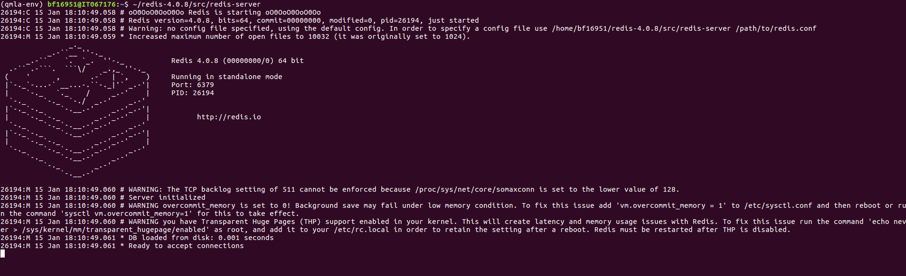

.. role:: raw-math(raw)
    :format: latex html

Tutorial
========

Here we provide a complete example of how to run the framework,
including how to implement a custom :term:`Exploration Strategy`, and generate/interpret analysis.

.. _section_installation:

Installation 
------------
First, *fork* the :term:`QMLA` codebase from
[QMLA]_ to a Github user account (referred to as :code:`username` in the following code snippet). 
Now, we must download the code base and
ensure it runs properly; these instructions are implemented via the
command line.
Note: these instructions are tested for Linux and presumed to work on Mac, but untested on Windows. 
It is likely some of the underlying software (redis servers) can not be installed on Windows,
so running on *Windows Subsystem for Linux* is advised. 

The steps of preparing the codebase are

#. install redis

#. create a virtual Python environment for installing :term:`QMLA` dependencies
   without damaging other parts of the user’s environment

#. download the :term:`QMLA` codebase from the forked Github repository

#. install packages upon which :term:`QMLA` depends.

.. code-block:: 
    :name: qmla_setup

    # Install redis (database broker)
    sudo apt update
    sudo apt install redis-server
     
    # make directory for QMLA
    cd
    mkdir qmla_test
    cd qmla_test

    # make Python virtual environment for QMLA
    # note: change Python3.6 to desired version
    sudo apt-get install python3.6-venv 
    python3.6 -m venv qmla-env    
    source qmla-env/bin/activate

    # Download QMLA
    git clone --depth 1 https://github.com/username/QMLA.git # REPLACE username

    # Install dependencies
    cd QMLA 
    pip install -r requirements.txt 

Note there may be a problem with some packages in the arising from the
attempt to install them all through a single call to :code:`pip install`. 
Ensure these are all installed before proceeding.
When all of the requirements are installed, test that the framework
runs. :term:`QMLA` uses databases to store intermittent data: we must
manually initialise the database. Run the following 
(note: here we list :code:`redis-4.0.8`, but this must be corrected to reflect the version installed on the
user’s machine in the above setup section):

::

    ~/redis-4.0.8/src/redis-server

which should give something like :numref:`fig:terminal_redis`.

   Terminal running :code:`redis-server`.

In a text editor, open :code`QMLA/launch/local_launch.sh`, 
the script used to run the codebase;  
here we will ensure that we are running the
algorithm, with 5 experiments and 20 particles, on the
:term:`Exploration Strategy` named :code:`TestInstall`.
Ensure the first few lines of read:

::

    #!/bin/bash

    ##### -------------------------------------------------- #####
    # QMLA run configuration
    ##### -------------------------------------------------- #####
    num_instances=2 # number of instances in run
    run_qhl=0 # perform QHL on known (true) model
    run_qhl_multi_model=0 # perform QHL for defined list of models
    experiments=2 # number of experiments
    particles=10 # number of particles
    plot_level=5

    ##### -------------------------------------------------- #####
    # Choose an exploration strategy 
    # This will determine how QMLA proceeds. 
    ##### -------------------------------------------------- #####
    exploration_strategy="TestInstall"

Ensure the terminal running redis is kept active, and
open a separate terminal window. 
We must activate the Python virtual environment configured for :term:`QMLA`, 
which we set up above. 
Then, navigate to the :term:`QMLA` directory, and launch:

::

    # activate the QMLA Python virtual environment 
    source qmla_test/qmla-env/bin/activate

    # move to the QMLA directory 
    cd qmla_test/QMLA
    # Run QMLA
    cd launch   
    ./local_launch.sh

There may be numerous warnings, but they should not affect whether
:term:`QMLA` has succeeded; :term:`QMLA` will any raise significant error.
Assuming the :term:`run` has completed successfully, :term:`QMLA` stores the run’s
results in a subdirectory named by the date and time it was started. For
example, if the was initialised on January :math:`1^{st}` at 01:23,
navigate to the corresponding directory by

::

    cd results/Jan_01/01_23

For now it is sufficient to notice that the code has run successfully: 
it should have generated (in :code:`Jan_01/01_23`) files like 
:code:`storage_001.p` and :code:`results_001.p`.

Custom exploration strategy
---------------------------

Next, we design a basic :term:`Exploration Strategy`, for the purpose of
demonstrating how to run the algorithm. 
Exploration strategies are placed in the directory 
:code:`qmla/exploration_strategies`.
To make a new one, navigate to the exploration
strategies directory, make a new subdirectory, and copy the template
file.

::

    cd ~/qmla_test/QMLA/exploration_strategies/
    mkdir custom_es

    # Copy template file into example
    cp template.py custom_es/example.py
    cd custom_es

Ensure :term:`QMLA` will know where to find the :term:`Exploration Strategy` 
by importing everything from the custom :term:`Exploration Strategy` 
directory into to the main module. 
Then, in the directory, make a file called which imports the new
:term:`Exploration Strategy` from the file. 
To add any further exploration strategies inside the
directory :code:`custom_es`, include them in the custom :code:`__init__.py`,
and they will automatically be available to :term:`QMLA`.

.. code-block:: python

    # inside qmla/exploration_strategies/custom_es
    #  __init__.py    
    from qmla.exploration_strategies.custom_es.example import *

    # inside qmla/exploration_strategies, add to the existing
    # __init__.py 
    from qmla.exploration_strategies.custom_es import *

Now, change the structure (and name) of the :term:`Exploration Strategy`
inside :code:`custom_es/example.py`. 
Say we wish to target the true model

.. math::
    :label: example_es_true_ham

    \vec{\alpha} = \left( \alpha_{1,2} \ \ \ \   \alpha_{2,3} \ \ \ \ \alpha_{3,4} \right)

    \vec{T} = \left( \hat{\sigma}_{z}^1 \otimes \hat{\sigma}_{z}^2 \ \ \ \ \hat{\sigma}_{z}^2 \otimes \hat{\sigma}_{z}^3 \ \ \ \  \hat{\sigma}_{z}^3 \otimes \hat{\sigma}_{z}^4 \right) 
    
    \Longrightarrow \hat{H}_{0} = \hat{\sigma}_{z}^{(1,2)} \hat{\sigma}_{z}^{(2,3)} \hat{\sigma}_{z}^{(3,4)} \\

:term:`QMLA` interprets models as strings, where terms are separated by :code:`+`, 
and parameters are implicit. So the target model in
:eq:`example_es_true_ham` will be given by

.. code:: 
    
    pauliSet_1J2_zJz_d4+pauliSet_2J3_zJz_d4+pauliSet_3J4_zJz_d4

Adapting the template :term:`Exploration Strategy` slightly, we can
define a model generation strategy with a small number of hard coded
candidate models introduced at the first branch of the exploration tree.
We will also set the parameters of the terms which are present in
:math:`\hat{H}_{0}`, as well as the range in which to search parameters. 
Keeping the :code:`import`s at the top of the :code:`example.py`, 
rewrite the :term:`Exploration Strategy` as:

::

    class ExampleBasic(
        exploration_strategy.ExplorationStrategy
    ):

        def __init__(
            self,
            exploration_rules,
            true_model=None,
            **kwargs
        ):
            self.true_model = 'pauliSet_1J2_zJz_d4+pauliSet_2J3_zJz_d4+pauliSet_3J4_zJz_d4'
            super().__init__(
                exploration_rules=exploration_rules,
                true_model=self.true_model,
                **kwargs
            )

            self.initial_models = None
            self.true_model_terms_params = {
                'pauliSet_1J2_zJz_d4' : 2.5,
                'pauliSet_2J3_zJz_d4' : 7.5,
                'pauliSet_3J4_zJz_d4' : 3.5,
            }
            self.tree_completed_initially = True
            self.min_param = 0
            self.max_param = 10

        def generate_models(self, **kwargs):

            self.log_print(["Generating models; spawn step {}".format(self.spawn_step)])
            if self.spawn_step == 0:
                # chains up to 4 sites
                new_models = [
                    'pauliSet_1J2_zJz_d4',
                    'pauliSet_1J2_zJz_d4+pauliSet_2J3_zJz_d4',
                    'pauliSet_1J2_zJz_d4+pauliSet_2J3_zJz_d4+pauliSet_3J4_zJz_d4',
                ]
                self.spawn_stage.append('Complete')

            return new_models

To run the example :term:`Exploration Strategy` for a meaningful test,
return to the :code:`local_launch.sh` script above, 
but change some of the settings:

::

    prt=2000
    exp=500
    run_qhl=1
    exploration_strategy=ExampleBasic

Run locally again then move to the results directory as in as in :ref:`section_installation`.    
Note this will take up to 15 minutes to run. 
This can be reduced by lowering the values of :code:`prt`, :code:`exp`, 
which is sufficient for testing but note that the outcomes will be less effective 
than those presented in the figures of this section.

Analysis
--------

:term:`QMLA` stores results and generates plots over the entire range of
the algorithm, i.e. the run, instance and models. 
The depth of analysis performed automatically is set by the user control
:code:`plot_level` in :code:`local_launch.sh`; 
for ``plot_level=1`` , only the most crucial figures are generated, 
while ``plot_level=5``  generates plots for every
individual model considered. For model searches across large model
spaces and/or considering many candidates, excessive plotting can cause
considerable slow-down, so users should be careful to generate plots
only to the degree they will be useful. Next we show some examples of
the available plots.

Model analysis
--------------

We have just run :term:`QHL` for the model in
:eq:`example_es_true_ham` for a single instance, using a reasonable
number of particles and experiments, so we expect to have trained the
model well. 
:term:`Instance`-level results are stored (e.g. for the instance
with ``qmla_id=1``) in ``Jan_01/01_23/instances/qmla_1``. 
Individual models’ insights can be found in , e.g. the model’s 
[fig:qmla\_learning\_summary], and in
[fig:qmla\_model\_dynamics].

Instance analysis
-----------------

Now we can run the full :term:`QMLA` algorithm, i.e. train several
models and determine the most suitable. :term:`QMLA` will call the
method of the :term:`Exploration Strategy`, set in [listing:basic\_es],
which tells :term:`QMLA` to construct three models on the first branch,
then terminate the search. Here we need to train and compare all models
so it takes considerably longer to run: the purpose of testing, we
reduce the resources so the entire algorithm runs in about 15 minutes.
Some applications will require significantly more resources to learn
effectively. In realistic cases, these processes are run in parallel, as
we will cover in [apdx:paralllel\_processing].

Reconfigure a subset of the settings in the script
([listing:local\_launch]) and run it again:

::

    exp=250
    prt=1000
    run_qhl=0
    exploration_strategy=ExampleBasic

In the corresponding results directory, navigate to , where instance
level analysis are available.

::

    cd results/Jan_01/01_23/instances/qmla_1

Figures of interest here show the composition of the models
([fig:qmla\_model\_composition]), as well as the :term:`bf` between
candidates ([fig:qmla\_bayes\_factors]). Individual model comparisons –
i.e. :term:`bf` – are shown in [fig:qmla\_bayes\_factor\_comparison],
with the dynamics of all candidates shown in
[fig:qmla\_branch\_dynamics]. The probes used during the training of all
candidates are also plotted ([fig:qmla\_training\_probes]).